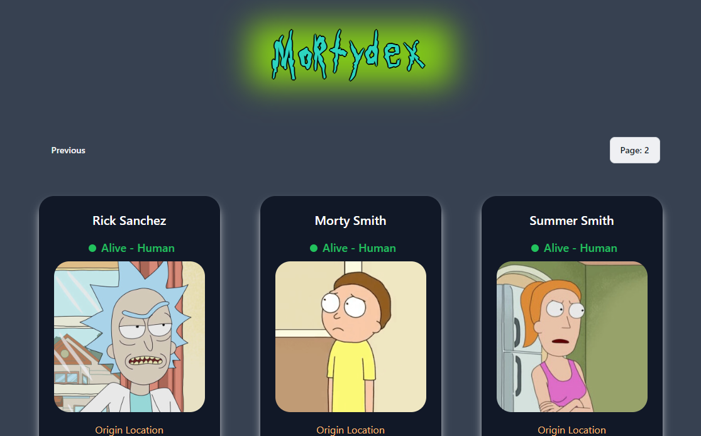

# Mortydex

[https://mortydex.vercel.app/](https://mortydex.vercel.app/)

## Tech Stack

- [Vite js](https://vitejs.dev/) - A build tool that aims to provide a faster and leaner development experience for modern web projects.
- [Tailwind Css](http://tailwindcss.com/) - A utility-first CSS framework packed with classes that can be composed to build any design, directly in your markup.
- [Vercel](https://vercel.com/) - A platform for frontend frameworks and static sites, built to integrate with your headless content, commerce, or database.
